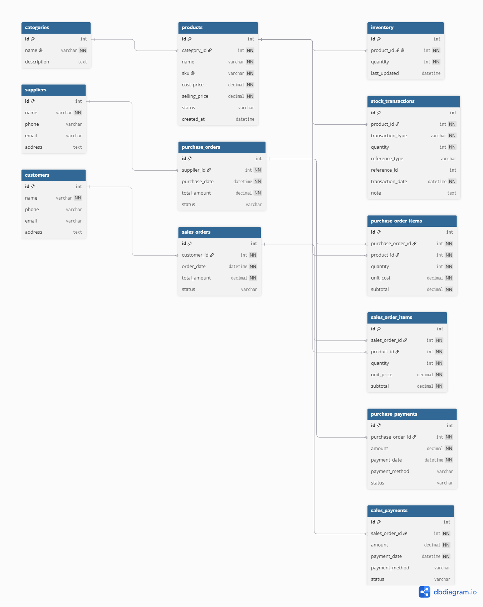

# Inventory & Order Management Database System

## Project Overview

The Inventory & Order Management Database System is a normalized relational database project built using MySQL. The system is designed to manage products, categories, suppliers, customers, purchases, sales, inventory, payments, and stock movement history for a retail business.

This project demonstrates database design principles, relational modeling, normalization, SQL reporting, and inventory management logic.

---

## Features

- Product Management
- Category Management
- Supplier Management
- Customer Management
- Purchase Order Management
- Sales Order Management
- Inventory Tracking
- Sales Payment Tracking
- Purchase Payment Tracking
- Stock Transaction History
- Inventory Reporting
- Due Payment Reporting
- Sales Reporting

---

## Database Design

The database is designed following normalization principles up to Third Normal Form (3NF) to reduce data redundancy and maintain data integrity.

### Core Tables

- Categories
- Products
- Suppliers
- Customers
- Purchase Orders
- Purchase Order Items
- Sales Orders
- Sales Order Items
- Inventory
- Sales Payments
- Purchase Payments
- Stock Transactions

---

## Entity Relationship Diagram (ERD)



---

## Relationships

### One-to-Many Relationships

- One Category → Many Products
- One Supplier → Many Purchase Orders
- One Customer → Many Sales Orders
- One Purchase Order → Many Purchase Order Items
- One Sales Order → Many Sales Order Items
- One Product → Many Stock Transactions
- One Sales Order → Many Sales Payments
- One Purchase Order → Many Purchase Payments

### One-to-One Relationship

- One Product → One Inventory Record

### Many-to-Many Relationships

Resolved using junction tables:

- Purchase Orders ↔ Products → Purchase Order Items
- Sales Orders ↔ Products → Sales Order Items

---

## Database Concepts Implemented

### Primary Keys

Every table contains a primary key (`id`) to uniquely identify records.

### Foreign Keys

Foreign keys are used to maintain relationships between tables.

Examples:

```sql
products.category_id -> categories.id

purchase_orders.supplier_id -> suppliers.id

sales_orders.customer_id -> customers.id

inventory.product_id -> products.id
```

### Constraints

Implemented constraints include:

- PRIMARY KEY
- FOREIGN KEY
- UNIQUE
- NOT NULL
- CHECK

Examples:

```sql
sku UNIQUE

quantity >= 0

cost_price >= 0

selling_price >= 0
```

---

## Inventory Management Logic

### Purchase Flow

Supplier → Purchase Order → Inventory Increase

When products are purchased:

1. Purchase Order is created
2. Purchase Order Items are inserted
3. Inventory quantity increases
4. Stock transaction is recorded

### Sales Flow

Customer → Sales Order → Inventory Decrease

When products are sold:

1. Sales Order is created
2. Sales Order Items are inserted
3. Inventory quantity decreases
4. Stock transaction is recorded
5. Payment information is stored

---

## Normalization

The database schema follows Third Normal Form (3NF).

### Benefits

- Reduced data redundancy
- Improved consistency
- Better scalability
- Easier maintenance
- Improved data integrity

Examples:

- Customer information is stored separately from sales orders
- Category information is stored separately from products
- Order details are stored using junction tables
- Inventory data is separated from transaction history

---

## SQL Concepts Used

### Joins

```sql
INNER JOIN
LEFT JOIN
```

### Aggregation

```sql
SUM()
COUNT()
GROUP BY
HAVING
```

### Reporting Queries

- Current Inventory Report
- Low Stock Report
- Customer Due Report
- Supplier Due Report
- Best Selling Products Report
- Daily Sales Report

---

## SQL Views

The project includes reporting views for simplified data access.

### Current Stock Report

```sql
current_stock_report
```

### Low Stock Report

```sql
low_stock_report
```

### Customer Due Report

```sql
customer_due_report
```

### Supplier Due Report

```sql
supplier_due_report
```

### Best Selling Products

```sql
best_selling_products
```

### Daily Sales Report

```sql
daily_sales_report
```

---

## Sample Business Queries

### Current Inventory

```sql
SELECT * FROM current_stock_report;
```

### Low Stock Products

```sql
SELECT * FROM low_stock_report;
```

### Customer Due Payments

```sql
SELECT * FROM customer_due_report;
```

### Supplier Due Payments

```sql
SELECT * FROM supplier_due_report;
```

### Best Selling Products

```sql
SELECT * FROM best_selling_products;
```

---

## Transaction Logic

The project includes transaction-safe inventory management concepts.

### Purchase Transaction

- Create purchase order
- Create purchase order items
- Increase inventory quantity
- Insert stock transaction record

### Sales Transaction

- Validate stock availability
- Create sales order
- Create sales order items
- Decrease inventory quantity
- Insert stock transaction record

This ensures inventory consistency and prevents incorrect stock calculations.

---

## Project Structure

```text
inventory-order-management-db

README.md

schema/
├── create_tables.sql
├── sample_data.sql
└── views.sql

queries/
├── inventory_queries.sql
├── sales_queries.sql
└── reporting_queries.sql

erd/
└── erd.png

docs/
├── requirements.md
└── normalization.md
```

---

## Technologies Used

- MySQL
- SQL
- phpMyAdmin
- XAMPP
- dbdiagram.io
- GitHub

---

## Learning Outcomes

Through this project, I practiced:

- Relational Database Design
- ERD Design
- Database Normalization (3NF)
- Primary Keys and Foreign Keys
- Data Integrity Constraints
- SQL Query Writing
- Inventory Management Logic
- Payment Tracking
- Business Reporting
- SQL Views
- Transaction Concepts
- Real-World Database Modeling

---

## Future Improvements

- Node.js + Express REST API
- Authentication & Authorization
- Inventory Dashboard
- Sales Analytics Dashboard
- Role-Based Access Control (RBAC)
- Stored Procedures
- Database Triggers

---
